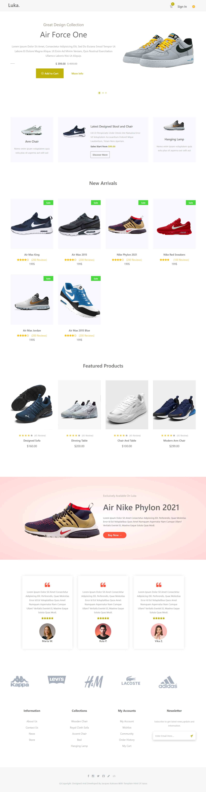

<div align="center" id="top"> 
  
 [](./capture1.webm)
  &#xa0;

  <video src='./capture1.webm.mov' width=180/>

   &#xa0;

   <video src='./capture2.webm.mov' width=180/>

   &#xa0;

  <a href="https://ecommerce-react-js-zeta.vercel.app/">Demo</a>
</div>

<h1 align="center">Shopping Shoes Reactjs</h1>

<p align="center">
  

  

  

  

  <!--  -->

  <!--  -->

  <!--  -->
</p>

<h3 align="center">Status</h3>

<h4 align="center"> 
	🚧  Shopping Shoes Reactjs 🚀 Under construction...  🚧
</h4> 

<hr>

<p align="center">
  <a href="#dart-about">About</a> &#xa0; | &#xa0; 
  <a href="#sparkles-features">Features</a> &#xa0; | &#xa0;
  <a href="#rocket-technologies">Technologies</a> &#xa0; | &#xa0;
  <a href="#white_check_mark-requirements">Requirements</a> &#xa0; | &#xa0;
  <a href="#checkered_flag-starting">Starting</a> &#xa0; | &#xa0;
  <a href="#memo-license">License</a> &#xa0; | &#xa0;
  <a href="https://github.com/jkm243" target="_blank">Jacques Katsuva</a>
</p>

<br>

## :dart: About ##

A full stack e-commerce website made with React, Express, MongoDB and NodeJS.

## :sparkles: Features ##

:heavy_check_mark: Responsive design;\
:heavy_check_mark: Dashboard;\
:heavy_check_mark: Login & Sign Up;\
:heavy_check_mark: Dark and light Mode;\

## :rocket: Technologies ##

The following tools were used in this project:

- [Expo](https://expo.io/)
- [Node.js](https://nodejs.org/en/)
- [React](https://pt-br.reactjs.org/)
- [MongoDb](https://www.mongodb.com/)
- [Eslint](https://eslint.org)
- [React switch](https://www.npmjs.com/package/react-switch)
<!-- - [Styled components](https://styled-components.com) -->

## :white_check_mark: Requirements ##

Before starting :checkered_flag:, you need to have [Git](https://git-scm.com) and [Node](https://nodejs.org/en/) installed.

## :checkered_flag: Starting ##

```bash
# Clone this project
$ git clone https://github.com/jkm243/ecommerce-reactjs

# Access
$ cd ecommerce-reactjs

# Install dependencies
$ yarn

# Run the project
$ yarn start

# The server will initialize in the <http://localhost:3000>
```

## :memo: License ##

This project is under license from MIT. For more details, see the [LICENSE](LICENSE.md) file.


Made with :heart: by <a href="https://github.com/jkm243" target="_blank">Jacques Katsuva</a>

&#xa0;

<a href="#top">Back to top</a>
